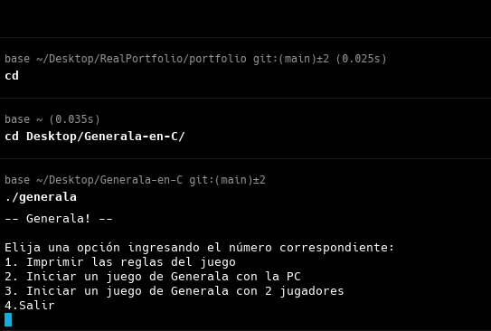
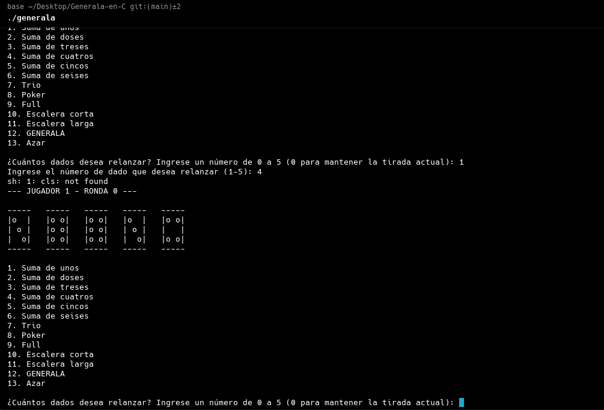

# Generala
Un proyecto de programación en C de pequeña escala y local para la clase de TAI 2024, diseñado para facilitar un juego de Generala para un jugador vs la máquina en un entorno de consola. 
Cuenta con una representación dinámica de los dados, mejorando la experiencia visual con cada lanzamiento. 
El programa está diseñado para monitorear las combinaciones que han sido utilizadas previamente, evitando su repetición. Automáticamente verifica cada tirada para confirmar 
si el jugador ha logrado la combinación requerida y asigna puntos basados en estos logros.

## 🎲 Capturas de Pantalla

### **Menú del Juego**

### **Ejemplo de Juego en Acción**

## Resumen de la Lógica de Verificación

1. **Control de Turnos**: Cada jugador tiene 13 turnos en los que puede lanzar los dados hasta tres veces.
2. **Selección de Combinaciones**: Los jugadores eligen combinaciones para puntuar, verificando si ya han sido usadas.
3. **Cálculo de Puntuaciones**: Cada combinación tiene su lógica específica para calcular los puntos.
4. **Actualización y Comparación de Puntuaciones**: Al finalizar el juego, se comparan las puntuaciones totales de ambos jugadores para determinar el ganador.

## 📂 Estructura del Proyecto
Para este proyecto de Generala, organizamos nuestro código en varios archivos diferentes: `generala.h`, `generala.c`, `main.c`, y `README.md`.

### **1. Archivo generala.h**
📌 **Propósito**: Este archivo se conoce como un archivo de encabezado (*header file*).  
📄 **Contenido**: Contiene las declaraciones de las funciones y las definiciones de las constantes que utilizamos en el programa.

### **2. Archivo generala.c**
📌 **Propósito**: Este archivo contiene la implementación de las funciones declaradas en `generala.h`.  
📄 **Contenido**: Aquí se define la lógica detallada del juego, incluyendo cómo se lanzan los dados, cómo se imprimen los resultados, cómo se gestionan los relanzamientos y cómo se calculan y actualizan las puntuaciones.

### **3. Archivo main.c**
📌 **Propósito**: Este archivo contiene la función `main()`, que es el punto de entrada del programa.
